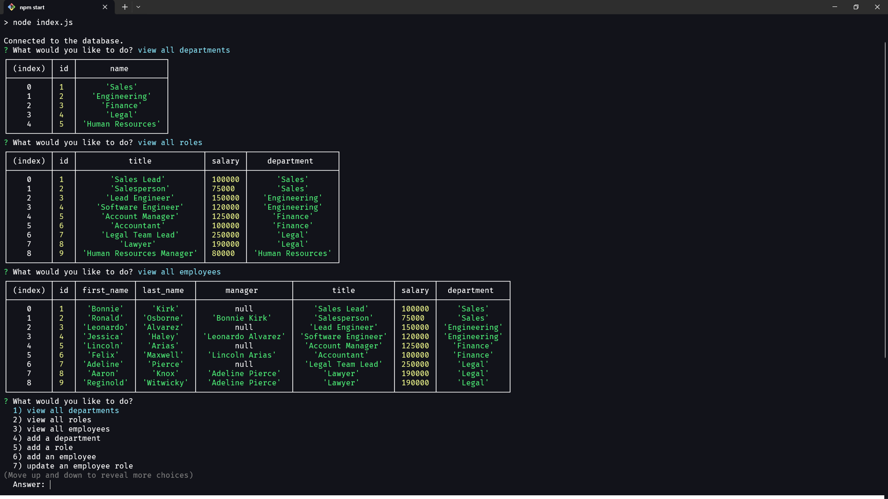

# Manageable
Manageable is a lightweight command-line application powered by inquirer.js.
It allows you to easily manage your workplace database and lays everything out in nice, organized tables.

## Installation
- clone the repo into folder of your choice
- run `npm i` in the cloned repo
- seed the database by running the `schema.sql` and `seeds.sql` files in the seeds folder
- start the application with `npm start`

## Preview
